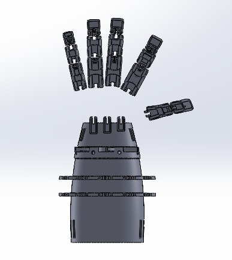

# Parkenson-s-desies-arm
this arm helps people with Parkenson's desies to retrive faster by doing some excersises with it 

#### Looks

<table>
  <tr>
      <td></td>
      <td></td>
  </tr>
</table>

<video> <source src="https://www.youtube.com/watch?v=C93SoHYeuz0" type="video/mp4"> </video>
<iframe width="560" height="315" src="https://www.youtube.com/watch?v=C93SoHYeuz0" frameborder="0" allowfullscreen></iframe>
